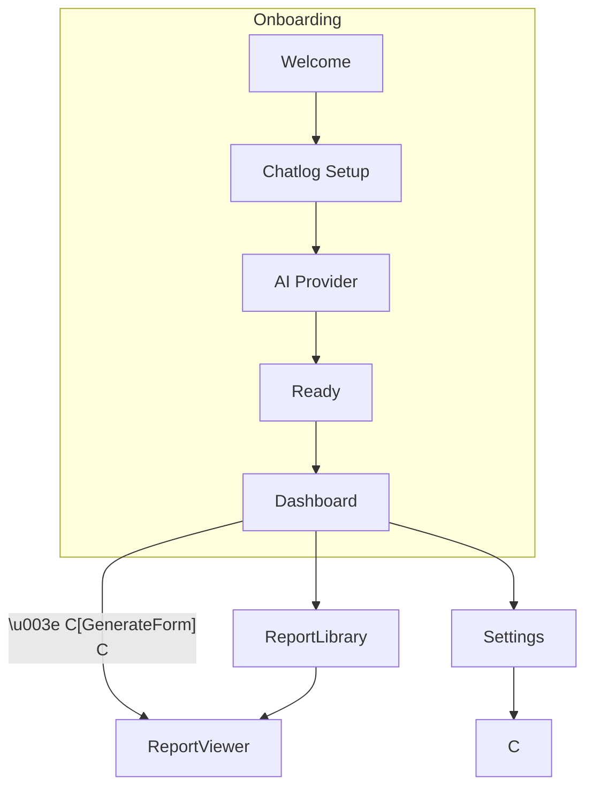

# EchoSoul MVP — 页面架构与导航关系

> 本文严格依据 `product.md` 中的 MVP 功能，规划首版桌面端（Electron + Vue）所需要的页面/路由、核心组件与页面间的导航关系，供产品、设计与开发同步参考。

## 1. 总览

```
┌─ AppShell (Electron Window)
│  ├─ Sidebar            (一级导航)
│  ├─ HeaderBar          (状态 & 快捷操作)
│  └─ <RouterView>       (渲染当前页面)
│
│   ┌─ OnboardingWizard  (首次启动向导)
│   │     ├─ Step1 Welcome
│   │     ├─ Step2 Chatlog Setup
│   │     ├─ Step3 AI Provider Setup
│   │     └─ Step4 Ready
│   │
│   ├─ Dashboard         (首页 / 默认页)
│   │     ├─ QuickGenerate  (新报告快捷卡片)
│   │     ├─ LastReports     (最近 5 份报告)
│   │     └─ SystemStatus    (服务 / API 状态)
│   │
│   ├─ GenerateForm      (新建报告表单)
│   │     └─ SinglePage Inputs (TimeRange, Target, Prompt, Generate)
│   │
│   ├─ ReportViewer      (查看单份报告)
│   │     ├─ OverviewCards
│   │     ├─ DetailSections (LLM 输出)
│   │     └─ ExportBar
│   │
│   ├─ ReportLibrary     (历史报告列表)
│   │     └─ Search & Filters
│   │
│   ├─ PromptLibrary     (Prompt 管理可选)
│   │     └─ CRUD Prompts
│   │
│   └─ Settings
│         ├─ ChatlogService  (连接状态 / 端口 / API)
│         ├─ AIProviders     (多 Provider API Key)
│         ├─ Preferences     (报告默认范围、导出格式)
│         └─ About           (版本 / 更新 / GitHub)
└────────────────────────────────────────────
```

## 2. 页面明细

### 2.1 AppShell（全局）

- **Sidebar**：固定宽度，使用 `--sidebar` 颜色；包含 Home、Generate、Library、Settings 图标 & 文本。
- **HeaderBar**：展示当前页面标题、暗色/浅色切换、最小化/关闭窗口按钮。

### 2.2 OnboardingWizard

| Step            | 目的                         | 主要控件                             |
| --------------- | ---------------------------- | ------------------------------------ |
| 1 Welcome       | 产品定位、隐私声明、一键开始 | 标题、Markdown 文案、`开始配置` 按钮 |
| 2 Chatlog Setup | 检测/安装 chatlog 服务       | 状态指示、路径选择、`测试连接`       |
| 3 AI Provider   | 选择 Provider、输入 API Key  | 单选卡片、文本框、`验证` 标签        |
| 4 Ready         | 总结配置、`进入 EchoSoul`    | 列表、完成按钮                       |

> 运行完毕后写入 `firstRun=false`，后续直接进入 Dashboard。

### 2.3 Dashboard

- **QuickGenerate**：迷你表单（最近一次选择预填）。
- **LastReports**：卡片列表，点卡片跳转 ReportViewer。
- **SystemStatus**：Chatlog & LLM 连接状态，若异常给出链接到 Settings 的 CTA。

### 2.4 GenerateForm `/generate`

单页表单包含三个输入区块：

1. **时间范围**：预设快捷（昨天 / 上周 / 上月）+ 自定义日期选择。
2. **分析对象**：联系人 / 群组多选，下拉搜索。
3. **Prompt**：下拉已有 Prompt + 预览；支持弹窗新建 Prompt。

交互流程：填写 → 点击 `生成报告`（primary 按钮）→ 调用后端创建报告任务并返回 `reportId` → 立即跳转到 `/report/:id`。

> 不单独展示“生成进度”页，ReportViewer 页面通过 SSE 流式更新内容并显示进度。

| -------------- | ------------------ | ------------------------------- |
| 1 TimeRange | `/wizard/time` | preset+custom daterange |
| 2 TargetSelect | `/wizard/targets` | 联系人/群组多选、搜索 |
| 3 PromptSelect | `/wizard/prompt` | 下拉 + 预览 + 新建 prompt modal |
| 4 Review | `/wizard/review` | 摘要卡片 + `生成` CTA |
| 5 Generating | `/wizard/progress` | 线性进度条、轮播提示语 |

生成完成后自动跳转到 `/report/:id`。

### 2.5 ReportViewer `/report/:id`

区域划分：

1. **OverviewCards**：消息总数、主要联系人、一句话总结。
2. **DetailSections**：按 Prompt 决定的 markdown/html；支持锚点目录。
3. **ExportBar**：导出 PDF/Markdown/HTML；按钮组用 primary 颜色。

### 2.6 ReportLibrary `/library`

- 表格或卡片视图切换。
- 条件：日期范围、关键词、Prompt 类型。
- 行操作：查看、重命名、删除、导出。

### 2.7 PromptLibrary

- 列表已有 Prompt，支持新建/编辑/删除。
- 字段：名称、描述、内容、多行文本（支持变量占位）。

### 2.8 Settings

子路由与 Tab 对应：

1. **ChatlogService**：服务地址、端口、连接测试按钮。
2. **AIProviders**：Provider 列表、API Key、安全说明、用量统计。
3. **Preferences**：默认时间范围、报告导出格式（PDF/HTML/MD）、语言、主题切换。
4. **About**：版本号、检查更新、License 链接。

## 3. 页面关系与导航流



## 4. 技术映射

| 页面          | Vue 组件目录建议                  | 关键依赖                        |
| ------------- | --------------------------------- | ------------------------------- |
| AppShell      | `layouts/AppShell.vue`            | Vue Router, Pinia               |
| Sidebar       | `components/Sidebar.vue`          | Heroicons                       |
| Onboarding    | `views/onboarding/*.vue`          | Wizard lib / 自研               |
| GenerateForm  | `views/generate/GenerateForm.vue` | vuelidate / date-picker         |
| ReportViewer  | `views/report/ReportViewer.vue`   | markdown-it, echarts            |
| ReportLibrary | `views/library/ReportLibrary.vue` | vuetify/v-data-table 或 ant-btn |
| Settings      | `views/settings/*.vue`            | System API 调用                 |

---

最后更新：2025-07-30（调整 GenerateForm + SSE 流式报告）
